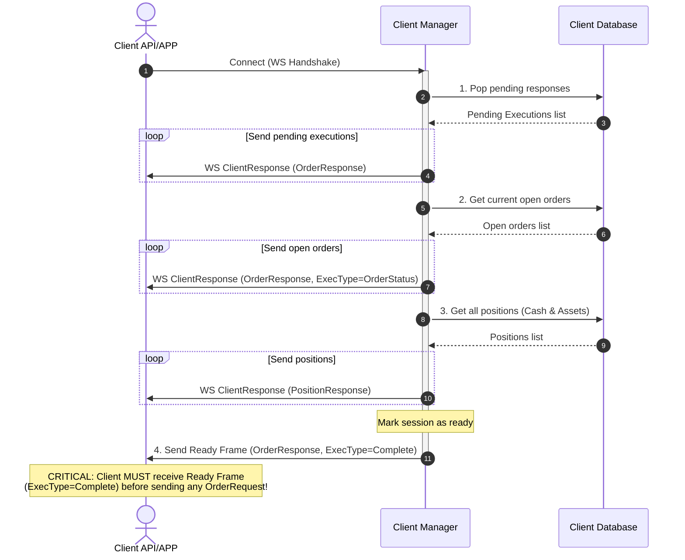
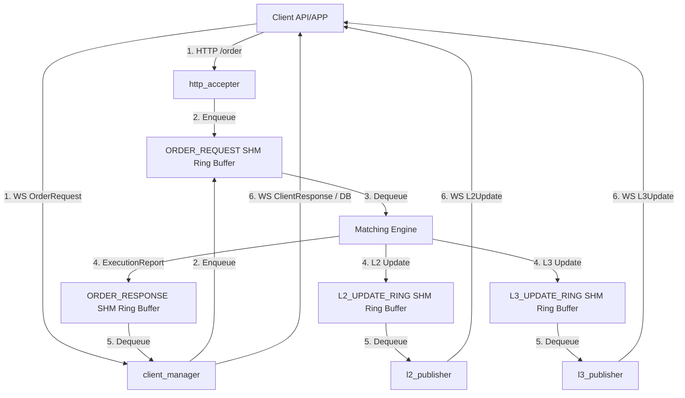
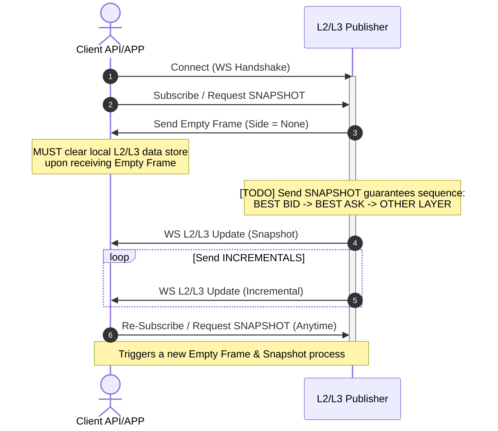
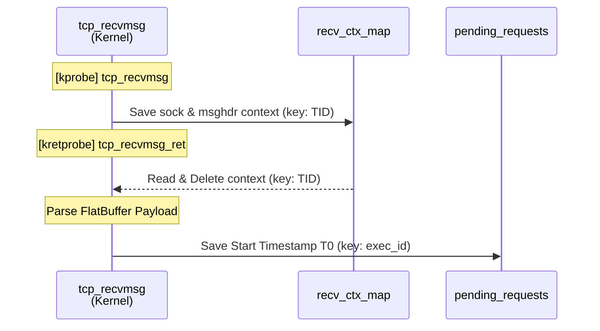
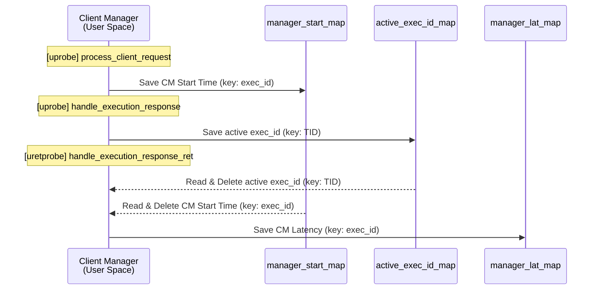
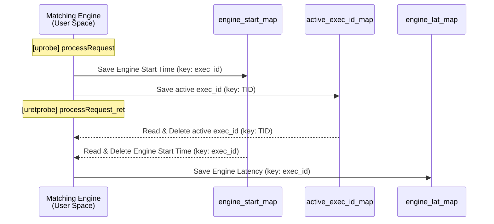
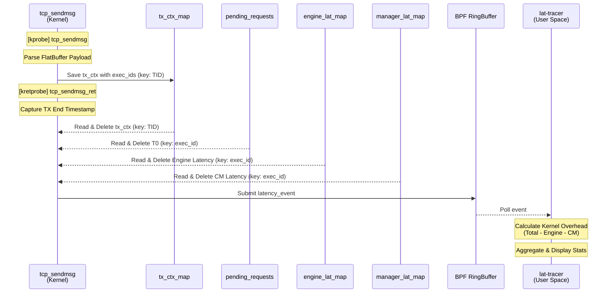

## Summary

It all started as a simple practice exercise to build a C++ matching engine. However, the relentless pursuit of lower latency and higher throughput quickly escalated the scope. What began as a single component has evolved into a complete, high-performance exchange ecosystem.

Designed with a strong emphasis on low-latency architecture and systematic observability, the project now features a comprehensive suite of components:
- **Core Engine & Gateways:** A highly optimized Matching Engine decoupled from the Client Manager and HTTP Acceptors via lock-free Shared Memory (SHM) Ring Buffers.
- **Client & Market Data Protocols:** WebSocket-based streaming for L2/L3 order book updates and execution reports, utilizing zero-allocation FlatBuffers for ultra-fast serialization.
- **Observability (eBPF):** A custom Linux eBPF latency tracer (`lat-tracer`) that hooks into kernel network stacks (`tcp_recvmsg`/`tcp_sendmsg`) and user-space C++ functions (`uprobes`). It measures end-to-end latency at the microsecond level, mathematically isolating kernel network overhead from application processing time.
- **Automated Trading Agents:** A built-in C++ algorithmic trading ecosystem, including a Market Maker for liquidity provision and a Stress Trader for simulating high-frequency market chaos and load testing.
- **Modern Web Frontend:** A React/TypeScript UI featuring dynamic data throttling and state decoupling to handle massive bursts of order book updates without freezing the browser.

This project serves as a showcase of applying both low-level system engineering (eBPF, IPC, memory management) and big-picture architectural design (microservices, real-time web, state decoupling) to build a robust trading system.

## Requires

```sh
sudo apt install -y flatbuffers-compiler libflatbuffers-dev
sudo apt install -y libgtest-dev libgmock-dev
sudo apt install -y build-essential git libssl-dev zlib1g-dev libboost-all-dev
# eBPF monitoring tools dependencies
sudo apt install -y clang libbpf-dev bpftool
```

## Log in process



## Order & Market Data flow



## L2/L3 Update & Subscription Phase



## Data Flow and Client Protocol

    ---H> Send through HTTP Channel
    --WS> Send through WebSocket Channel
    --RB> Send through Ring Buffer

OrderRequest: Client ---H> HTTP Server --RB> ORDERBOOK_CORE
    
    OrderRequest in flatbuffers format

PreAcked:     HTTP Server ---H> Client

    Only inform Client that HTTP server received OrderRequest, futher information will be sent as Executions from CLIENT_MANAGEMENT.

Executions:   ORDERBOOK_CORE --RB> CLIENT_MANAGEMENT 
                             --WS> Client + ---> DB(Status=SENT)      (if Client loged in)
                             ----> DB(Status=PENDING)                 (if Client loged out)
    
    Connection built -> Client log in -> Check and send cached Executions -> accept request
    Acceptable Request: 1. OrderRequest in flatbuffers format
                        2. Current position and Cash
                        3. Current Pending Order Status
                        (Use union format flatbuffers, TODO)

L2 Update:    ORDERBOOK_CORE --RB> L2_PUBLISHER --WS> Client

    Connection built -> Accepting Request
    Acceptable Request: 1. Subscription -> receive SNAPSHOT -> receive INCREMENTALS
                        2. Unsubscription
                        3. Resend Subscription will be consider identically as the first time and send SNAPSHOT, in case client lost.

    SNAPSHOT: Empty frame ahead, same sturcture as INCREMENTALS
    Empty frame: Side=None
    RB: L2_UPDATE_RING

L3 Update:    Same as L2

    RB: L3_UPDATE_RING

## eBPF Latency Tracer (lat-tracer)

The `lat-tracer` eBPF program measures end-to-end latency of order requests by hooking into kernel networking functions and user-space application functions (uprobes). It breaks down the total latency into Kernel Network Overhead, Client Manager Processing, and Matching Engine Processing.

### Latency Tracing Workflow

#### 1. Recording starting time (tcp_recvmsg)



#### 2. Client Manager Processing



#### 3. Matching Engine Processing



#### 4. TX Path & Userspace Aggregation (tcp_sendmsg)



#### Responsibilities

**Kernel Space (eBPF)**:
1. **Network Hooks**: Intercepts `tcp_recvmsg` (entry/exit) to parse incoming FlatBuffer payloads for `exec_id` and records the start timestamp. Intercepts `tcp_sendmsg` to parse outgoing responses and compute total latency.
2. **Application Hooks (Uprobes)**: Attaches to C++ functions in `ClientManager` and `OrderBook`. Computes the time spent inside the Matching Engine and the Client Manager.
3. **Data Aggregation**: Retrieves the latency components when the response is sent out, bundles them into a `latency_event`, and pushes them to User Space.

**User Space (C++)**:
1. **Setup**: Loads the eBPF object, attaches kprobes and uprobes, and sets up the Ring Buffer.
2. **Processing**: Polls the Ring Buffer for `latency_event` structures.
3. **Analytics & Display**: Calculates the pure kernel networking overhead by subtracting application latencies from the total latency. Aggregates data by execution type (New, Modify, Cancel) and calculates percentiles (p50, p90, p99, p999), printing a real-time table to standard output.
