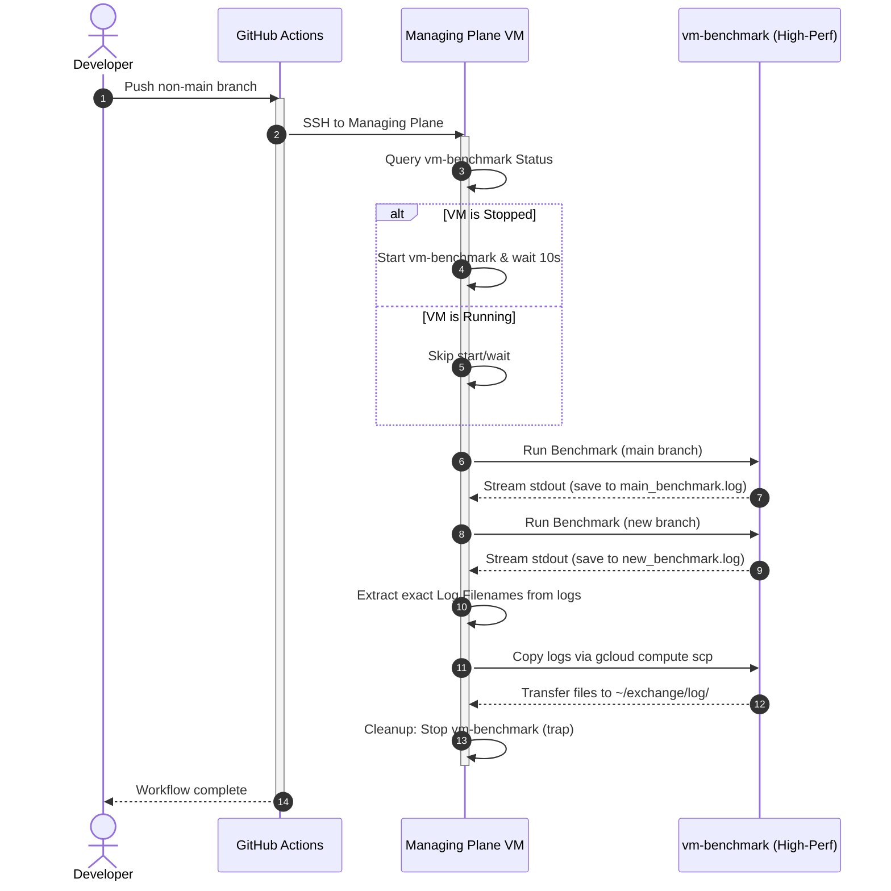

# The Story of VM-Benchmark Automation: Conception & Refinement

This document tells the story of how I designed, implemented, and optimized the GitHub Actions benchmark workflow for the Exchange project. It details the engineering challenges I encountered along the way and how I resolved them to build a highly robust, self-healing, and cost-efficient benchmark pipeline.

---

## 1. The Starting Goal & Architectural Evolution

I wanted to establish a benchmark workflow that runs on a dedicated high-performance virtual machine (`vm-benchmark`), triggered whenever any branch other than `main` is pushed to GitHub. 

### Why the Managing Plane VM? (The "Forwarder" Design)
My initial approach was simple:
1. Have the GitHub Actions runner utilize `gcloud` directly to start the high-performance `vm-benchmark` instance.
2. Run the tests.
3. Stop the instance.

However, this ran into a major roadblock: **GCP Service Account limitations**. Service accounts cannot easily generate access keys to authenticate the external GitHub Actions runner directly.

To work around this limitation, I designed the **Managing Plane VM (Forwarder) Architecture**:
* Instead of running `gcloud` on the GitHub Actions runner, the runner SSHes into a cheap, persistent VM (the **managing plane VM**).
* Since the managing plane VM is already hosted on GCP and has an authorized, active `gcloud` login, it can execute `gcloud` commands locally without needing external key-based IAM configuration.
* The managing plane VM acts as a secure controller/forwarder, orchestrating `vm-benchmark` on behalf of the GitHub Actions runner.

```
[GitHub Actions Runner]
       │
       ▼ (SSH using GCP_SSH_PRIVATE_KEY)
[Managing Plane VM (Forwarder/Controller)]
       │
       ├─► (gcloud compute instances start/stop)
       └─► (gcloud compute ssh / scp)
[vm-benchmark (High-Performance VM)]
```

---

## 2. Phase 1: Dynamic VM Management & Safety First

### The Challenge
Because `vm-benchmark` is a high-performance, high-cost machine, keeping it running 24/7 is not an option. It must be started at the beginning of the workflow and stopped immediately when finished. 
However, CI/CD pipelines are inherently prone to failures (e.g., compile errors, test failures). If a compilation fails, the script exits early, and the stop command is skipped, leaving the VM running indefinitely and accumulating cost.

### The Conception
I resolved this by using a shell **`trap`** on the managing plane VM.
Additionally, to prevent hardcoding GCP Zones in my scripts, I decided to query the VM's zone dynamically.

```bash
# Find the zone dynamically
ZONE=$(gcloud compute instances list --filter="name=vm-benchmark" --format="value(zone)" | head -n 1)

# Register a cleanup trap that is guaranteed to run on script exit (even on failure)
cleanup() {
  echo "Cleaning up: Stopping vm-benchmark..."
  gcloud compute instances stop vm-benchmark --zone="$ZONE" || true
}
trap cleanup EXIT
```
This ensured that no matter what happened during compilation or testing, the instance would always shut down safely.

---

## 3. Phase 2: The Slash "/" Branch Name Bug

### The Challenge
When pushing branches like `feature/benchmark` to GitHub, my benchmark script threw errors. The benchmark script uses the branch name to generate log files:
`LOG_FILE="log/benchmark-${BRANCH}-${DATE}-${COMMIT}.log"`

Since the branch name contained a `/` (slash), the redirection target became `log/benchmark-feature/benchmark-...log`. Because the `log/benchmark-feature/` directory did not exist, the file redirection failed.

### The Conception
Instead of adding complex directory creation steps, I sanitized the branch name right in the `scripts/run-benchmark` script. I leveraged bash parameter expansion to replace all slashes with underscores:
```bash
BRANCH=$(run_git symbolic-ref --short HEAD 2>/dev/null || run_git rev-parse --short HEAD)
BRANCH="${BRANCH//\//_}" # Replace all "/" with "_"
```
This converted `feature/benchmark` to `feature_benchmark` dynamically, keeping logs nicely organized under a single flat directory `log/`.

---

## 4. Phase 3: Bulletproof Log Retrieval

### The Challenge
Once logs are generated on `vm-benchmark`, they need to be copied back to the managing plane VM.
A naive approach would list the log directory and copy the newest file:
`ls -t ~/exchange-main/log/benchmark-*.log | head -n 1`

However, this is highly fragile under consecutive execution:
* If the benchmark fails on the current run and fails to generate a log, `ls -t` will match the log from the *previous* run.
* The workflow would copy old logs back and present them as new results, silent-failing the observability.

### The Conception
I wanted a 100% deterministic way to retrieve only the log file generated during the current execution.
I solved this by **capturing the stdout of the benchmark process**:
1. I stream the benchmark output to a local temporary log file on the managing plane VM using `tee`.
2. I then parse the console output using `grep` to extract the exact filename printed by `run-benchmark` (`Logging stdout to: ...`).
3. I copy only that specific file.

```bash
# Run the benchmark and save stdout
gcloud compute ssh vm-benchmark ... --command "sudo ./scripts/run-benchmark" | tee main_benchmark.log

# Extract the exact filename from the stdout log
MAIN_LOG_REL=$(grep -o 'log/benchmark-.*\.log' main_benchmark.log | head -n 1 || true)

# Copy the exact file
if [ -n "$MAIN_LOG_REL" ]; then
  gcloud compute scp ... vm-benchmark:"~/exchange-main/$MAIN_LOG_REL" ~/exchange/log/
fi
```
This decoupling guarantees that I only ever retrieve the correct, freshly-minted log file.

---

## 5. Phase 4: CI Dependencies & Make Reliability

### The Challenge
The web frontend of the exchange requires `npm` and `Node.js` to build. However:
1. These packages were missing from my CI workflows and installation guides.
2. In `web/Makefile`, `node_modules` was set as a directory-based Make target. Because directory timestamps update whenever any file inside them changes, Make is notoriously unreliable at managing directories as targets, sometimes skipping package installations even when `package.json` changed.

---

## Summary of the Final Architecture

The final implementation is an automated and optimized feedback loop:


Through this evolutionary design, I achieved a secure, fast, and completely deterministic benchmark harness that is easy to maintain and highly robust against failures.

---

## 7. LinkedIn Post Version

Here is a version of this story ready to be shared on LinkedIn:

🚀 **How to build a zero-cost-leak, high-performance benchmark pipeline in GCP**

Running performance benchmarks on high-compute VM instances is critical for low-latency systems. But how do you orchestrate these instances securely and cost-effectively in a CI/CD pipeline?

Recently, I designed a benchmark harness for my C++ matching engine project. Here is the journey of how I solved key infrastructure and automation challenges:

🔹 **The Challenge:**
1. **Cost Control:** High-compute VMs are expensive. I need them online *only* during active benchmarks. If a build/test fails, the VM *must* be shut down automatically to prevent cost leaks.
2. **GCP Service Account limitations:** Service accounts cannot easily generate access keys to authenticate the external GitHub Actions runner directly.

🔹 **The Solution (The "Forwarder" Architecture Workaround):**
* **Managing Plane VM:** Instead of authenticating the GitHub Actions runner directly, the runner SSHs into a cheap, persistent "controller" VM. Since it runs within GCP and has an active `gcloud` session, it safely orchestrates the high-compute `vm-benchmark` instance.
* **Fail-Safe Cleanup:** Using shell `trap` hooks on the controller VM, I ensure the high-perf VM is unconditionally stopped on exit, even if compilation or testing crashes.
* **Smart Startup:** The controller checks VM status first. If `vm-benchmark` is already running, it skips the startup and stabilization wait time.

🔹 **The Log Matching Problem (Determinism):**
A naive `ls -t` command to fetch the newest log file is fragile—if a run fails to output a log, it mistakenly retrieves stale logs from previous runs. 
👉 I solved this by streaming the SSH output to a file via `tee` and parsing the stdout in real time using `grep` to extract the *exact* filename generated during that specific run. No guess-work, 100% deterministic log collection.

🔹 **Key Takeaways:**
✅ **Workarounds for Service Account limitations:** Work around authentication constraints by leveraging secure internal proxy architectures.
✅ **Resilience:** Always design fail-safes (like shell traps) to prevent infrastructure cost leaks.
✅ **Clean Builds:** Transitioning from directory-based Make targets to explicit recipes ensures reliable dependency management in CI.

How do you handle dynamic VM orchestration in your CI/CD pipelines? Let's discuss! 👇

#GCP #CloudArchitecture #DevOps #CI_CD #GitHubActions #LowLatency #SystemsEngineering #Infrastructure
